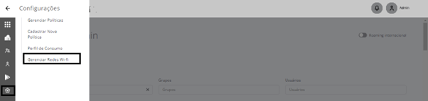
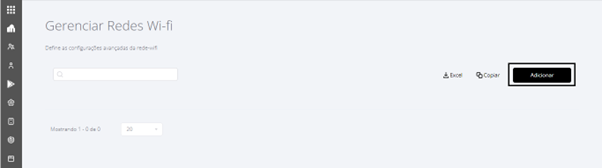
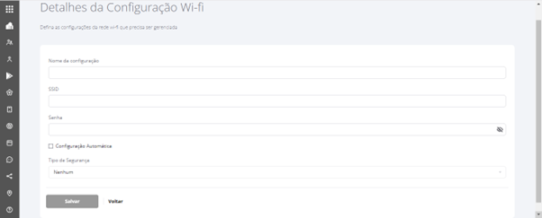
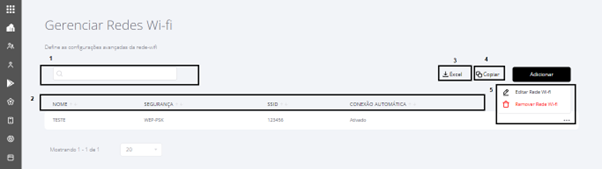

# 16.4 Gerenciar Redes Wi-fi

### 16.4 Gerenciar Redes Wi-fi 

Para acessar a tela Gerenciar Redes Wi-fi, devemos acessar o menu “**Configurações”** e o Submenu “**Gerenciar Redes Wi-fi”** conforme segue:

<figure><figcaption></figcaption></figure>

Ao acessar o submenu a tela abaixo será exibida, clique em **ADICIONAR:**

<figure><figcaption></figcaption></figure>

Após clicar em **ADICIONAR**, a seguinte tela para preenchimento dos dados da Rede Wi-fi , será exibida. Todos os campos devem ser preenchidos e por fim clicar em Salvar.

<figure><figcaption></figcaption></figure>

Após Salvar, o portal retornará à tela anterior, onde será exibida a rede salva e caso existam outras redes , serão listadas também.

1. Utilize o campo de busca para pesquisar um rede cadastrada;
2. Utilize as setas nos campos NOME, SEGURANÇA,SSID ou CONEXÃO AUTOMÁTICA para ordenar as informações;
3. Para exportar os dados, utilize o botão Excel;
4. Para copiar os dados, utilize o botão Copiar;
5. Ao clicar nos três (...) pontinhos, serão exibidas as opções de Editar Rede Wi-fi e Remover Rede Wi-fi

<figure><figcaption></figcaption></figure>
