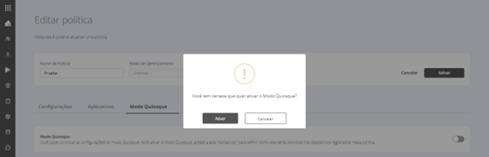

# Modo Quiosque

**16.1.1.3 Modo Quiosque**

Esta configuração tem como objetivo possibilitar a criação de um ambiente em que o usuário do dispositivo possa acessar somente os aplicativos previamente liberados pelo administrador, ou seja, apenas os ícones dos aplicativos selecionados serão exibidos na tela do dispositivo.

.png>)

Para acessar as configurações de "**Modo Quiosque**" siga os seguintes passos:\

1. Na tela "**Editar política**", selecione a guia "**Modo Quiosque**".
2. Ative o modo quiosque clicando sobre o botão de ativação.
3. Será exibida na tela uma mensagem para confirmação. Confirme clicando no botão "**Ativar**".

<figure><figcaption></figcaption></figure>

1. Defina se o botão "Power" estará disponível ou bloqueado para o usuário.
2. Defina se a exibição de mensagens de erro estará ativa ou silenciada.
3. Defina as informações que serão exibidas na barra de status: notificações e informações do sistema, apenas informações do sistema ou nenhuma.
4. Defina o acesso a configurações como liberado ou bloqueado.
5. Clique no botão "Salvar" para salvar as configurações definidas.

.png>)
