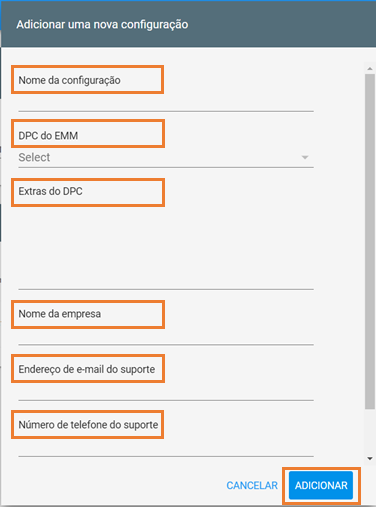
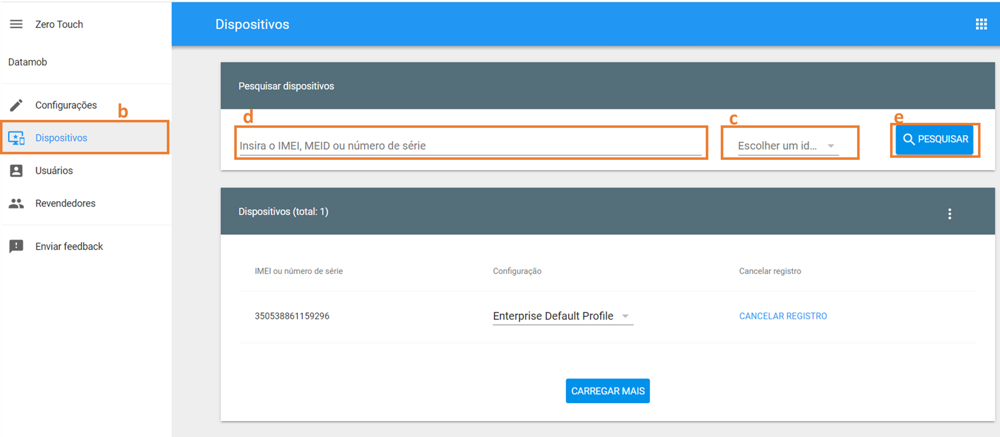
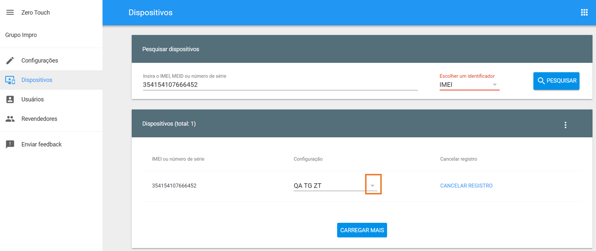
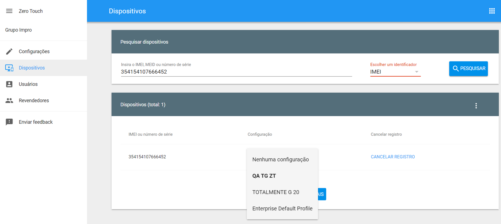
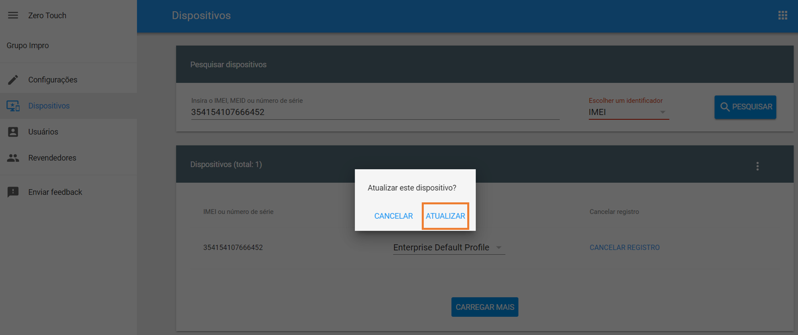

# 🤳 19 ZERO TOUCH

**19 ZERO TOUCH**

O registro Zero Touch é um processo simplificado para dispositivos Android a serem provisionados para gerenciamento empresarial. O dispositivo inicia o método de provisionamento de dispositivo totalmente gerenciado e baixa o aplicativo Datamob Enterprise associado, que conclui a configuração do dispositivo.

Este método de implantação é perfeito para dispositivos Android corporativos, tornando as implementações em grande escala rápidas, fáceis e seguras. O Zero Touch simplifica a configuração de dispositivos on-line e o envio com gerenciamento reforçado para que os funcionários possam abrir a caixa e começar.

Para usar o registro Zero Touch, você precisará de dispositivos compatíveis com Android 8.0 ou superior. Além disso, todos os dispositivos com Android 9 e superior são compatíveis com toque zero.

> Veja a lista de dispositivos compatíveis com Zero Touch:
>
> [https://androidenterprisepartners.withgoogle.com/devices/#!?device\_features=zero\_touch](https://androidenterprisepartners.withgoogle.com/devices/#!?device\_features=zero\_touch)

**19.1 Vinculação da Conta Zero Touch**

Para iniciar a utilização do Zero Touch siga os seguintes passos:

1. Entrar em contato com a Datamob para adquirir os aparelhos (se necessário) e solicitar a criação da conta de cliente Zero Touch.
2. Aguardar pela criação da sua conta Zero-Touch pela Datamob
3. Uma vez criada a conta Zero-Touch, acesse o Portal Datamob Enterprise, menu “Zero Touch” e faça a vinculação da conta com o Portal Datamob Enterprise seguindo o processo após selecionar o botão “Próxima” \[veja abaixo]

.png>)

**Inserir usuário e senha e confirmar**

**19.2 Configurando os dispositivos para Zero-Touch**

Nesta etapa serão definidas as configurações e bloqueios que serão aplicadas aos dispositivos.

Para configurar siga os seguintes passos:

1. Acesse o Painel Zero-Touch e selecione a opção “Configurações”

\[ [https://partner.android.com/zerotouch](https://partner.android.com/zerotouch) ]

1. Selecione o ícone “+” à direita da tela para criação de uma nova configuração

.png>)

É necessário preencher os seguintes campos que serão de identificação para o usuário do dispositivo.

1. “Nome da Configuração”: Identifique a configuração desejada;
2. “DPC do EMM”: Android Device Police;
3. “Extras do DPC”: Seguir os passos do item 2.3;
4. “Nome da Empresa”: Nome da Empresa;
5. “Endereço de e-mail do suporte”: Informe o e-mail de suporte da sua empresa;
6. “Número de telefone do suporte”: Informe o telefone de suporte da sua empresa.

.png>)

1. No Portal Datamob Enterprise, defina qual a política será aplicada ao Zero-Touch, podendo ser uma nova política ou já existente para configurar manualmente a política na configuração Zero-Touch seguindo os passos abaixo:
   1. Acesse o menu “Configurações” do Datamob Enterprise;
   2. Selecione a opção “Gerenciar Políticas”;
   3. Selecione a política desejada;
   4. No menu agrupado selecione “Token de Registro”;
   5. Copie “Configuração Zero-Touch”.

1. No portal Zero-Touch, adicione esta informação no campo “Extras DPC” da Configuração Zero-Touch desejada

1. Identifique o IMEI correspondente ao dispositivo que deseja registrar na configuração criada
   1. Acesse o Portal Datamob Enterprise;
   2. Selecione o menu “Dispositivos”
   3. Selecione o submenu “Lista de Dispositivos”
   4. Localize o dispositivo e copie a informação do IMEI
2. Com a informação da IMEI do dispositivo, siga os passos abaixo:
   1. Acesse o Portal Zero Touch e selecione o menu “Dispositivos”

\[ [https://partner.android.com/zerotouch](https://partner.android.com/zerotouch) ]

1. No campo “Escolher um identificador” selecione a opção “IMEI”;
2. Insira o IMEI no campo “Insira o IMEI, MEID ou número de série”
3. Selecione o botão “pesquisar”

1. Será apresentado o dispositivo com a configuração atual. Para alterar siga os seguintes passos:

1. Selecione a seta na coluna “Configuração” \[figura 1]
2. Selecione a configuração desejada \[figura 2]
3. E pressione o botão “Atualizar” \[figura 3]

Importante ressaltar que se este dispositivo está em uso, após selecionar o botão “Atualizar” será enviada uma mensagem ao usuário solicitando reiniciar o dispositivo. Ao reiniciar as configurações serão alteradas.

\[figura 1]

\[figura 2]

\[figura 3]

