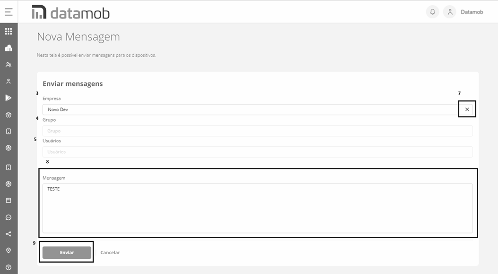

# 23 GEOLOCALIZAÇÃO

**23 GEOLOCALIZAÇÃO**

Esta tela do sistema tem como objetivo possibilitar ao usuário visualizar as localizações geográficas de um dispositivo ativo em uma data específica.

**IMPORTANTE:**

A precisão da informação da localização é diretamente influenciada pela qualidade do hardware do GPS. Em alguns dispositivos, o registro da localização poderá não ser preciso devido à qualidade do hardware do GPS. Assim, em locais com baixa qualidade do sinal do GPS (como por exemplo em edifícios, estacionamentos ou em locais fechados) o dispositivo pode não registrar a localização ou ter o registro pouco preciso. Nesses casos, para melhorar o registro da localização, deve ser habilitada a alta precisão do GPS no dispositivo.

Para saber como visualizar as localizações geográficas de um dispositivo, siga os passos descritos nesta seção.

1. Clique no menu “**Localização**” para acessar as opções de localização.
2. Clique em "**Geolocalização**" para abrir a tela.

1. Selecione o usuário do dispositivo que deseja visualizar as localizações;
2. Selecione a data em que as localizações foram registradas;
3. Especifique o fuso horário em que deseja visualizar as localizações;
4. Selecione o limite de precisão das localizações;
5. Clique no botão “Buscar” para exibir as localizações no mapa, de acordo com filtro especificado;
6. O sistema exibirá as localizações com marcadores formando o percurso realizado pelo usuário do dispositivo. Os marcadores possuem cores diferentes, que indicam o tipo da localização. Utilize a legenda para identificar o tipo:

**Posição inicial da leitura do GPS** – primeira localização do dispositivo registrada no dia;

**Posição atual ou última posição coletada no dia** – última localização do dispositivo registrada no dia;

**Local onde o usuário passou** – localizações registradas no dia, entre a primeira e a última.

1. Clique no marcador para visualizar as informações da localização.
2. Utilize os recursos do mapa para otimizar a visualização.
