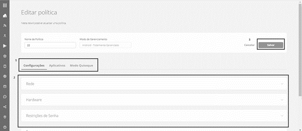

# Gerenciar Políticas

**16.1 Gerenciar Políticas**

Ao acessar a opção "**Gerenciar Políticas**" abrirá a tela apresentada na sequência.

.png>)

.png>)

A tela apresenta os elementos que são padrão em todas as telas de listagens do sistema, os quais são descritos abaixo:

1. Filtro que pode ser aplicado a listagem de políticas cadastradas para auxiliar a encontrar políticas.
2. Listagem das políticas cadastradas no sistema.
3. Mais ações de gerenciamento para uma política podem ser acessadas clicando sobre os "..." localizados no final da linha da política.

.png>)

1. **Editar Política -** abre a tela para gerenciar as configurações da política.
2. **Remover Política -** abre uma caixa de mensagem para confirmação da exclusão da política. Clicando no botão "Remover" a política será removida do sistema.
3. **Token de Registro -** abre o Token de Registro e mais informações desta tela estão na seção 16.1.2
4. **Copiar Política -** abre uma caixa de mensagem para nomear a cópia criada da política selecionada.
5. Para exportar as informações dos usuários, clique no botão “Excel”.
6. Para copiar as informações dos usuários, clique no botão “Copiar”.
7. Clicar no botão Nova Política, para cadastrar uma nova política.

**16.1.1 Editar Política**

Esta tela do sistema tem como objetivo permitir a configuração de todos os detalhes de uma política.

Na imagem a seguir é apresentada a tela "**Editar Política**" e em destaque os itens:

1. Guias de configurações - Alterne entre as guias para ver as "Configurações" gerais, as configurações de “Aplicativos" e do "Modo Quiosque".&#x20;
2. Grupos de configurações da guia "Configurações" - clique sobre cada grupo para ver todas as configurações.&#x20;
3. Para salvar todas as configurações (gerais, aplicativos e modo quiosque) clique no botão "Salvar".&#x20;

<figure><figcaption></figcaption></figure>

Cada uma das guias de configuração (marcação 1 da figura anterior) são descritas nas próximas subseções.
