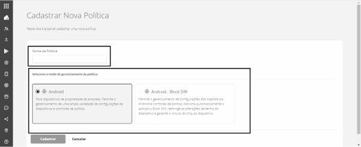

# Cadastrar Nova Política

Esta tela do sistema tem o objetivo de realizar o cadastro de novas políticas. Para iniciar o cadastro de uma nova política escolha a opção "Cadastrar Nova Política" no menu "Configurações".

.png>)

A tela inicial do cadastro de políticas é apresentada na sequência.

<figure><figcaption></figcaption></figure>

Para cadastrar uma nova política siga os seguintes passos:

1. Digite um nome para a política.
2. Escolha um dos modos de gerenciamento da política:

* **Android** - Para dispositivos de propriedade da empresa. Permite o gerenciamento de uma ampla variedade de configurações de dispositivos e controles de política.
* **Android - Block SIM -** Permite o gerenciamento de configurações dos dispositivos Android e controles de política. Adiciona automaticamente o aplicativo Block SIM, restringe as alterações de senha do dispositivo e garante o vínculo do chip ao dispositivo.

3. Clique em "Cadastrar".

Após o cadastro da política será aberta a tela "Editar Política" para que os detalhes da política sejam configurados. A seção [Editar Política](editar-politica/) mostra os detalhes da configuração de políticas.
