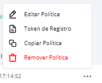

# Modo Quiosque

Esta configuração tem como objetivo possibilitar a criação de um ambiente em que o usuário do dispositivo possa acessar somente os aplicativos previamente liberados pelo administrador, ou seja, apenas os ícones dos aplicativos selecionados serão exibidos na tela do dispositivo.

Para acessar as configurações de "**Modo Quiosque**" siga os seguintes passos:

1. Na tela "**Editar política**", selecione a guia "**Modo Quiosque**".
2. Ative o modo quiosque clicando sobre o botão de ativação.

<figure><figcaption></figcaption></figure>

3. Será exibida na tela uma mensagem para confirmação. Confirme clicando no botão "**Ativar**".

<figure><figcaption></figcaption></figure>

4. Ao ativar o Modo Quiosque na política e provisionar um dispositivo com esta política, o aplicativo **Kiosk Launcher Manager** será instalado automaticamente no dispositivo.

Quando o dispositivo instalar o aplicativo Kiosk, o aplicativo capturará a lista de todos os aplicativos instalados no dispositivo enviará esta lista para o Portal. Além disto enviará as seguintes configurações gerenciadas para o portal.  E alterará a launcher do Dispositivo para a launcher do aplicativo Kiosk, não permitirá que o usuário altere a launcher no dispositivo e manterá a configuração de Modo Quiosque recebida na politica.


**NOTA**\
Ao ativar o Modo Quiosque, para o correto funcionamento do aparelho ou de alguma aplicação, se faz necessário, a inclusão de forma manual dos seguintes pacotes de Sistema:&#x20;

\- Acessibilidade Samsung: **com.samsung.accessibility**

\- Lupa de pesquisa: **com.android.settings.intelligence**

\- Pop-up "Abrir com" do navegador: **com.android.intentresolver / android**

\- Pop-up "Abrir com" do sistema: **com.android.systemic / android**

\- Instalações OTA (Over-the-air) para dispositivos Samsung: **com.wssyncmldm**

\- Transferência de arquivos quando conectado no PC: **com.android.systemui / com.samsung.android.MtpApplication**

Para saber mais sobre como incluir aplicativos de forma manual na política , leia a sessão: [Aplicativos](aplicativos.md).


### Opções de configuração do Quiosque

Estando o modo quiosque ativado, as seguintes opções de configuração estarão disponíveis:&#x20;

<mark style="color:red;background-color:orange;">Separei em 2 imagens, 1:</mark>

<figure><figcaption></figcaption></figure>

* **Botões de navegação**: permite definir os botões de navegação do dispositivo como "Ativo", "Bloqueado" ou "Apenas botão Home";
* **Botão "Power"**:  permite definir o botão power do dispositivo como "Disponível" ou "Bloqueado";
* **Exibir Mensagens de Erro**: permite definir a exibição de mensagens de erro como "Ativo" ou "Silenciado";
* **Informações Exibidas na Barra de Status**: permite definir as informações que serão exibidas na barra de status do dispositivo.  Pode ser definido como "Notificações e informações do sistema", "Apenas informações do sistema" ou "Nenhuma";
* **Acesso à Configurações**: permite definir como "Liberado" ou "Bloqueado";
* **Serviços Adicionais de Telefonia**: permite definir os serviços de telefonia como "Ativo" ou "Definido pelo dispositivo".  Ao definir como "Ativo" e salvar a política, o sistema enviará na política e no quiosque os pacotes dos serviços de telefonia para o dispositivo, e permitirá receber e realizar ligações no dispositivo que provisionar a política. E ao definir como "Definido pelo Dispositivo", o dispositivo funcionará de acordo com a sua configuração padrão, tendo ou não os serviços.

<mark style="color:red;background-color:orange;">Separei em 2 imagens, 2:</mark>

<figure><figcaption></figcaption></figure>

* **Papel de parede** - pode ser realizado o upload de uma imagem de papel de parede na política e definido a orientação de tela, que serão enviados para o aplicativo

<figure><figcaption></figcaption></figure>

* **Cor da fonte dos ícones -** permite configurar a cor do texto dos ícones na tela inicial

<figure><figcaption></figcaption></figure>

* **Orientação de Tela -** permite selecionar a orientação de tela para o dispositivo, e o padrão é: “Definido pelo usuário"

<figure><figcaption></figcaption></figure>

* **Tamanho de ícones e Fontes -** permite selecionar as seguintes opções de tamanho de exibição: Padrão do sistema _(padrão),_ Pequeno (_75%_) e Grande (_125%_)

<figure><figcaption></figcaption></figure>

* **Ordenação dos ícones -** permite realizar a ordenação dos ícones

<figure><figcaption></figcaption></figure>

* **Posicionamento da imagem -** permite selecionar a posição da imagem do papel de parede na tela inicial do dispositivo

<figure><figcaption></figcaption></figure>

* <mark style="color:red;">**Bloquear acesso as configurações de Wi-Fi -**</mark> <mark style="color:red;"></mark><mark style="color:red;">impede que os usuários acessem e modifiquem as configurações de Wi-Fi durante a inicialização e uso do dispositivo no modo Kiosk.</mark>

<mark style="color:red;background-color:orange;">NOVA IMAGEM</mark>

<figure><figcaption></figcaption></figure>

* <mark style="color:red;">**Acesso Temporário ao Dispositivo -**</mark> <mark style="color:red;"></mark><mark style="color:red;">permite configurar um período temporário durante o qual o usuário pode acessar o dispositivo.</mark>

<mark style="color:red;background-color:orange;">NOVA IMAGEM</mark>

<figure><figcaption></figcaption></figure>

Os aplicativos que serão exibidos no dispositivo, serão definidos na política, ou seja, somente os aplicativos liberados na política serão exibidos na laucher.
