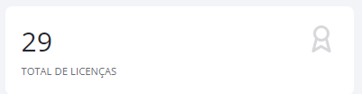
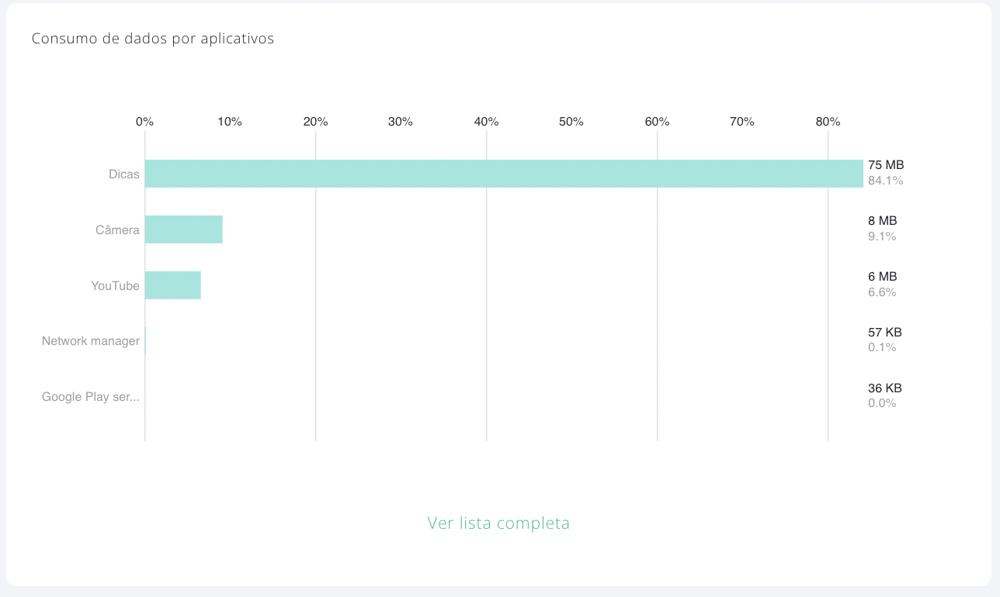
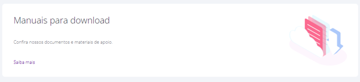

# 📊 DASHBOARD

Esta tela do sistema tem como objetivo possibilitar ao usuário a visualização e análise dos diversos dados de consumos e usos coletados dos dispositivos. Todos esses dados serão detalhados nesta seção.

Para saber como acessar e analisar os dados exibidos no Dashboard, siga os passos descritos nesta seção.

1. A tela de Dashboard pode ser considerada a “**Tela Inicial**” do sistema, pois é exibida assim que acessa o Portal, mas também pode ser acessada clicando no menu “Dashboard”. Em um primeiro acesso, os indicadores de usuários, dispositivos e consumos não terão ainda informações, por isso estarão zerados.

 (1).png>)

Ao acessar a tela, todas as informações serão exibidas separadas por seções. Cada seção corresponde a um dado diferente, coletado do dispositivo e todas as informações são exibidas de acordo com as opções selecionadas no filtro (Empresa, Grupo ou Usuário).

2. Ao habilitar a opção do filtro “**Roaming internacional**”, no canto superior direito da tela, o sistema exibirá somente as informações coletadas quando os dispositivos estiverem utilizando uma conexão em Roaming.

 (1) (1).png>)

Os filtros “Empresa”, “Grupo” e “Usuário” permitem realizar uma análise dos dados dos dispositivos de um nível determinado.

3. Clique no filtro “**Empresa**”, digite e selecione o nome da empresa para exibir as informações coletadas de todos os dispositivos.

 (1) (1).png>)

4. Clique no filtro “**Grupo**”, digite e selecione o nome do grupo, para exibir as informações coletadas de todos os dispositivos que fazem parte de um Grupo.

.png>)

5. Clique no filtro “**Usuário**” digite e selecione o usuário, para exibir as informações coletadas do dispositivo do usuário.

.png>)

6. No canto superior direito da tela, temos alguns ícones que tem as seguintes funcionalidades:

<figure><figcaption></figcaption></figure>

## **Barra de Status**

A barra de status do Dashboard mostra a situação atual de todos os usuários e licenças da empresa.

.png>)

## **Total de Usuários**

Este indicador exibe o número total de usuários de dispositivos que utilizam o aplicativo **\<NomeProduto>.**

## **Total de Licenças**

Este indicador exibe o número total de licenças disponíveis no **\<NomeProduto>**.

## **Licenças não instaladas no portal**

Este indicador exibe o número total de licenças que não possuem dispositivo registrado no portal. Ou seja, são as licenças disponíveis.

Ao clicar nesse indicador, o sistema exibirá a tela de "**Licenças Contratadas**". Para saber como utilizar essa tela, leia a seção [“**Licenças Contratadas**”](dashboard.md#total-de-licencas).

## **Dispositivos**

Este indicador exibe o número total de dispositivos que estão ativos no sistema e os dispositivos sem comunicação. Além disso, possibilita ao administrador ter a visibilidade dos dispositivos que estão em Modo Quiosque.

* **TOTAL -** Esses dispositivos são considerados “**Ativos**” ao instalar e ativar o aplicativo **\<NomeProduto>.**

Ao clicar em "**Total**” o indicador exibirá a tela “**Lista de Dispositivos**” contendo o relatório com as principais informações dos dispositivos ativos.

* **SEM COMUNICAÇÃO -** Este indicador exibe o número total de dispositivos que não estão enviando dados aos servidores a um período prolongado. Ao clicar em "**Sem Comunicação**” o sistema exibe a tela de dispositivos sem comunicação.

<figure><figcaption></figcaption></figure>

Esta falta de comunicação pode ocorrer quando o dispositivo se encontrar nas seguintes situações:

* Desligado;
* Sem conexão de internet;
* Aplicativo desinstalado.

O cálculo de tempo para considerar o dispositivo sem comunicação é baseado em duas informações enviadas pelo dispositivo:

* Envio de consumos gerais/informações do dispositivo;
* Envio periódico de status “Ativo”.

Caso passe mais de 10 minutos e o Portal não receba uma destas informações, o dispositivo é considerado como “Sem comunicação” e envia um comando para o dispositivo tentar restabelecer a comunicação. Dependendo da situação do dispositivo, o restabelecimento da comunicação poderá ocorrer ou não.

Ao clicar nesse indicador o sistema exibirá uma tela contendo o relatório com as informações dos dispositivos que estão sem comunicação.

## **Consumo de Dados no Ciclo**

Este indicador exibe o percentual de consumo de dados móveis dos dispositivos durante o ciclo em relação ao limite total configurado no Perfil de Consumo. Caso não seja configurado um limite no Perfil de Consumo, o gráfico não exibirá o percentual, e o sistema exibirá apenas o valor total de dados em MB utilizados.

## **Consumo de SMS no Ciclo**

Este indicador exibe o percentual de consumo de SMS enviados pelos dispositivos durante o ciclo em relação ao limite total configurado no Perfil de Consumo. Caso não seja configurado um limite no Perfil de Consumo, o gráfico não exibirá o percentual, e exibirá apenas o valor total de SMS utilizados.

## **Consumo de Dados por Aplicativo**

Este gráfico exibe os 5 aplicativos que mais consumiram dados móveis durante o ciclo. Os dados exibidos, são ordenados em percentual.

O valor percentual de cada um dos 5 aplicativos é calculado em relação à soma total de consumo de todos os aplicativos durante o ciclo.

Ao clicar no botão “Ver lista completa” o sistema exibirá a tela com as informações de todos os aplicativos. Para saber como utilizar essa tela, leia a seção “[**Aplicativos**](broken-reference)” deste manual.

## **Consumo de Dados por Usuário**

Este gráfico exibe os 5 usuários que mais consumiram dados móveis durante o ciclo. Os dados exibidos são ordenados em percentual.

O valor percentual de cada um dos 5 usuários é calculado em relação à soma total de consumo de todos os usuários durante o ciclo.

Ao clicar no botão “Ver lista completa” o sistema exibirá a tela com as informações de consumos da empresa. Para saber como utilizar essa tela, leia a seção “[Consumo da Empresa](broken-reference)” deste manual.

## **Tempo de Uso por Aplicativo**

Este gráfico exibe os 5 aplicativos que mais foram utilizados durante o ciclo. Este tempo é contabilizado apenas quando o aplicativo está em uso, e não precisa estar consumindo dados. Os aplicativos em segundo plano não são contabilizados nesta análise.

O valor percentual de cada um dos 5 aplicativos é calculado em relação à soma total do tempo de uso de todos os aplicativos durante o ciclo.

Ao clicar no botão “Ver lista completa” o sistema exibirá a tela com as informações de todos os aplicativos.

## **Indicador de Consumo e Histórico**

Este indicador exibe em percentuais os dados móveis e SMS consumidos nos últimos 6 ciclos.

Para realizar a análise individual dos consumos de dados móveis ou SMS, acesse o item **"**[**Consumos**](broken-reference)**"** no menu "[**Empresas**](broken-reference)".

## **Indicador de Novos Usuários de Dispositivos e Histórico**

Este indicador exibe a quantidade de usuários de dispositivos ativados nos últimos 6 ciclos e a evolução dos novos usuários do ciclo atual em relação aos do trimestre e do semestre.

Para realizar a análise individual dos usuários de dispositivos, clique em "**Lista de Dispositivos**" no menu "[**Dispositivos**](dashboard.md#dispositivos)".

## **Localização dos Dispositivos**

O mapa exibe a última localização dos dispositivos. Para que a localização seja exibida e atualizada, o dispositivo deve estar conectado à internet, deve haver sinal de GPS e a configuração de "**Modo de Localização**" deve estar "**Ativa**" em Localização na política aplicada ao dispositivo.

Leia a seção “[**Gerenciar Políticas**](broken-reference)” deste manual para saber como ativar o "**Modo de Localização**" dos dispositivos.

A localização dos dispositivos é exibida com um marcador no mapa, que pode estar na cor verde ou vermelha, dependendo do status do dispositivo (verde = enviando dados e vermelho = sem envio de dados). Para visualizar as informações da localização, clique no marcador.

Utilize os recursos do mapa para otimizar a visualização das localizações.

## **Manuais para Download**

Nesta tela teremos acesso aos manuais para download. Ao clicar no Saiba mais, será exibida a tela com Documentos e Materiais de Apoio.

## **Alguma Dúvida**

Através da sessão “[**Alguma Dúvida**](dashboard.md#alguma-duvida)?”, teremos acesso a tela onde é possível visualizar as perguntas frequentes realizadas pelos usuários:

Ao clicar em Saiba mais, seremos direcionado a tela a seguir, onde é possível realizar uma pesquisa através do campo de digitação livre ou então filtrar por categoria.

Ao rolar a tela mais para baixo, teremos acesso a lista de perguntas frequentes

E no final da página teremos acesso também aos manuais para Download , assim como temos no Dashboard.

<figure><figcaption></figcaption></figure>
