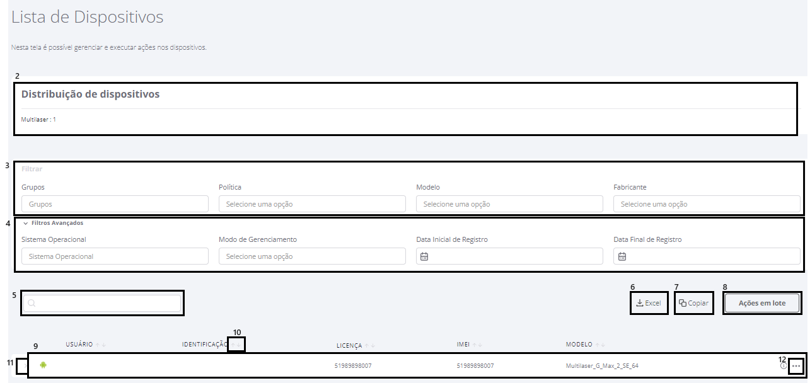

---
layout:
  title:
    visible: true
  description:
    visible: false
  tableOfContents:
    visible: true
  outline:
    visible: true
  pagination:
    visible: true
---

# Lista de dispositivos

Para gerenciar os dispositivos ativos da empresa, siga os passos descritos abaixo.

1. Clique no menu “**Dispositivos**” opção "**Lista de Dispositivos**" para acessar a tela

<figure><figcaption></figcaption></figure>

<mark style="color:red;background-color:orange;">NOVA IMAGEM</mark>

<figure><figcaption></figcaption></figure>

2. Na parte superior da tela o sistema exibe a distribuição dos dispositivos, separados por fabricantes
3. Use os filtros Grupo, Política, Modelo e Fabricante para encontrar os dispositivos se deseja listar
4. Utilize os Filtros Avançados para buscar Modo de Gerenciamento e Data Inicial de Registro e Data Final de Registro (filtrará pela data de registro dos dispositivos que estão no período especificado) para acessar as informações desejadas
5. Para localizar um dispositivo específico, digite o número do telefone, nome do usuário, IMEI ou ICCID do dispositivo no campo “Pesquisar”
6. Para exportar o relatório dos dispositivos, clique no botão “Excel”
7. Para copiar as informações dos dispositivos, clique no botão “Copiar”
8. Clique na opção de “Ações em lote" para aplicar uma ação em vários dispositivos de uma vez só. Para mais informações, acessar o conteúdo [Ações em lote](./#acoes-em-lote) nesta página
9. A lista de dispositivos é mostrada na parte inferior da tela
10. Ordene a listagem de dispositivos pelas colunas nas setas "↑↓"
11. Clique no ">" para visualizar todas as informações do dispositivo, para mais informações, acessar o conteúdo[ Informações do Dispositivo](./#informacoes-do-dispositivo) nesta página.
12. Use os três pontinhos "..." para exibir o menu de ações e aplicar a ação desejada ao dispositivo

### Ações em lote

Ao clicar na opção **“Ações em lote"** o sistema exibirá uma tela contendo alguns campos para preenchimento, conforme pode ser visto na tela abaixo.&#x20;

<figure><figcaption></figcaption></figure>

* **Empresa:** clique no campo empresa e no nome da empresa para enviar um camando para todos os dispositivos da empresa (ao selecionar a empresa, os campos de grupo e usuário ficaram desabilitado)
* **Grupos:** clique em grupo e escolha o grupo desejado
* **Usuário de dispositivos**: clique em usuário e escolha o usuário desejado.&#x20;
* **Comandos:** clique em comando e escolha o comando desejado (Desativar dispositivo, Ativar dispositivo, Desligar tela, Reiniciar dispositivo ou Remover dispositivo (Wipe))

<figure><figcaption></figcaption></figure>

Após definir os dados da tela clique em **"Enviar"** para enviar o comando.  Antes de executar o envio, o sistema abrirá uma caixa de diálogo com os botões "Confirmar" e "Cancelar".&#x20;

<figure><figcaption></figcaption></figure>

### **Informações do Dispositivo**

As informações do dispositivo exibidas na lista são:

* **Usuário -** nome do usuário cadastrado no portal;
* **Identificação -** Identificação cadastrada para o dispositivo;
* **Telefone -** número de telefone;
* **IMEI -** número interno e único em cada dispositivo. No Android 10 já não é possível capturar esta informação do dispositivo porque utilizamos outro método para receber esta informação com o Enriquecimento de URL;
* **Modelo -** modelo do dispositivo;

Clicando no sinal ">" ao lado do usuário, o sistema exibe mais informações conforme pode ser visto na imagem abaixo.

<mark style="color:red;background-color:orange;">NOVA IMAGEM</mark>

<figure><figcaption></figcaption></figure>

* **Política** - nome da política atribuída ao dispositivo;
* **Modo de Gerenciamento** - modo de gerenciamento atribuído ao dispositivo;
* **Versão do app \<NomeProduto> -** versão do companion instalado no dispositivo;
* **ICCID -** número do chip SIM;
* **Fabricante** - nome do fabricante do dispositivo;
* **Sistema** **operacional** - versão do Android;
* **Data** **de** **registro** - data e hora do registro do dispositivo;
* **Grupo** - grupo ao qual o dispositivo está associado;
* <mark style="color:blue;">**Departamento**</mark> <mark style="color:blue;"></mark><mark style="color:blue;">- É um campo de texto livre, ou seja, o administrador pode digitar o que desejar. Indica a unidade ou departamento da organização ao qual o dispositivo está atribuído;</mark>
* <mark style="color:blue;">**Telefone do Usuário**</mark> <mark style="color:blue;"></mark><mark style="color:blue;">- É um campo de texto livre, ou seja, o administrador pode digitar o que desejar. Indica o número de telefone associado ao usuário do dispositivo;</mark>
* **Data da última comunicação** - última comunicação do dispositivo;
* **Status** - informa status do dispositivo. Os status que um dispositivo pode ter estão na tabela a seguir:

<table data-header-hidden><thead><tr><th width="164.98324022346367"></th><th></th></tr></thead><tbody><tr><td><strong>Status</strong></td><td><strong>Descrição</strong></td></tr><tr><td>Ativo</td><td>O dispositivo está ativo.</td></tr><tr><td>Desabilitado</td><td>O dispositivo está desativado.</td></tr><tr><td>Deletado</td><td>O dispositivo foi excluído. Esse estado é usado no relatório de status final quando o dispositivo confirma a exclusão.</td></tr><tr><td>Provisionando</td><td>O dispositivo está sendo provisionado. Os dispositivos recém registrados ficam nesse estado até que uma política seja aplicada.</td></tr></tbody></table>
