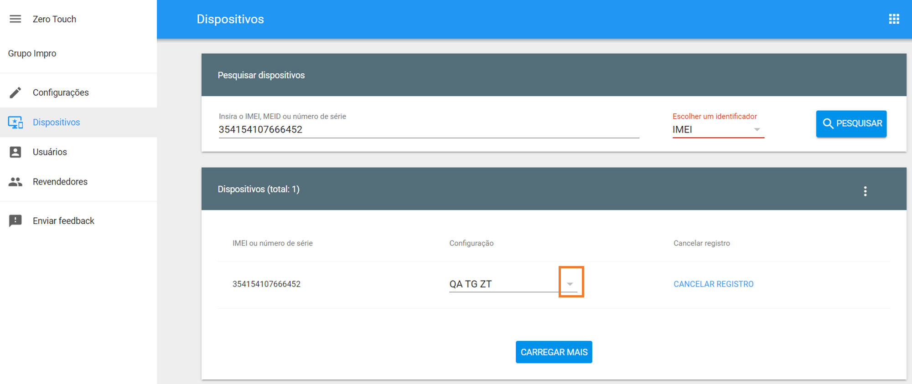
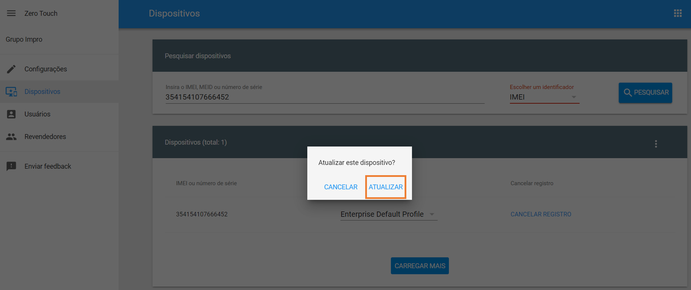

# Zero Touch

O registro Zero Touch é um processo simplificado para dispositivos Android a serem provisionados para gerenciamento empresarial. O dispositivo inicia o método de provisionamento de dispositivo totalmente gerenciado e baixa o aplicativo **\<NomeProduto>** associado, que conclui a configuração do dispositivo.

Este método de implantação é perfeito para dispositivos Android corporativos, tornando as implementações em grande escala rápidas, fáceis e seguras. O Zero Touch simplifica a configuração de dispositivos on-line e o envio com gerenciamento reforçado para que os funcionários possam abrir a caixa e começar.

Para usar o registro Zero Touch, você precisará de dispositivos compatíveis com Android 8.0 ou superior. Além disso, todos os dispositivos com Android 9 e superior são compatíveis com toque zero.

> Veja a lista de dispositivos compatíveis com Zero Touch:
>
> [https://androidenterprisepartners.withgoogle.com/devices/#!?device\_features=zero\_touch](https://androidenterprisepartners.withgoogle.com/devices/#!?device\_features=zero\_touch)

### **Vinculação da Conta Zero Touch**

Para iniciar a utilização do Zero Touch siga os seguintes passos:

1. Entrar em contato com a Operadora para adquirir os aparelhos (se necessário) e solicitar a criação da conta de cliente Zero Touch.
2. Aguardar pela criação da sua conta Zero-Touch pela Operadora
3. Uma vez criada a conta Zero-Touch, acesse o **\<NomeProduto>**, menu “**Zero Touch**” e faça a vinculação da conta com o **\<NomeProduto>** seguindo o processo após selecionar o botão “**Próxima**”.

.png>)

4. Inserir usuário e senha e confirmar

### **Configurando os dispositivos para Zero-Touch**

Nesta etapa serão definidas as configurações e bloqueios que serão aplicadas aos dispositivos.

Para configurar siga os seguintes passos:

1. Acesse o Painel Zero-Touch e selecione a opção “**Configurações**”

\[[https://partner.android.com/zerotouch](https://partner.android.com/zerotouch)]

2. Selecione o ícone “+” à direita da tela para criação de uma nova configuração

.png>)

É necessário preencher os seguintes campos que serão de identificação para o usuário do dispositivo.

* “Nome da Configuração”: Identifique a configuração desejada;
* “DPC do EMM”: Android Device Policy;
* “Extras do DPC”;
* “Nome da Empresa”: Nome da Empresa;
* “Endereço de e-mail do suporte”: Informe o e-mail de suporte da sua empresa;
* “Número de telefone do suporte”: Informe o telefone de suporte da sua empresa.

.png>)

3.  No **\<NomeProduto>**, defina qual a política será aplicada ao Zero-Touch, podendo ser uma nova política ou já existente para configurar manualmente a política na configuração Zero-Touch seguindo os passos abaixo:

    Acesse o menu “Configurações” do **\<NomeProduto>**;

* Acesse o menu “Configurações” do **\<NomeProduto>**;
* Selecione a opção “Gerenciar Políticas”;
* Selecione a política desejada;
* No menu agrupado selecione “Token de Registro”;
* Copie “Configuração Zero-Touch”.

4. No portal Zero-Touch, adicione esta informação no campo “Extras DPC” da Configuração Zero-Touch desejada

5. Identifique o IMEI correspondente ao dispositivo que deseja registrar na configuração criada

* Acesse o **\<NomeProduto>**;
* Selecione o menu “Dispositivos”
* Selecione o submenu “Lista de Dispositivos”
* Localize o dispositivo e copie a informação do IMEI

6. Com a informação da IMEI do dispositivo, siga os passos abaixo:

* Acesse o Portal Zero Touch e selecione o menu “Dispositivos” \[[https://partner.android.com/zerotouch](https://partner.android.com/zerotouch)]
* No campo “Escolher um identificador” selecione a opção “IMEI”;
* Insira o IMEI no campo “Insira o IMEI, MEID ou número de série”;
* Selecione o botão “pesquisar”;

7. Será apresentado o dispositivo com a configuração atual. Para alterar siga os seguintes passos:

* Selecione a seta na coluna “Configuração”
* Selecione a configuração desejada
* E pressione o botão “Atualizar”

Importante ressaltar que se este dispositivo está em uso, após selecionar o botão “Atualizar” será enviada uma mensagem ao usuário solicitando reiniciar o dispositivo. Ao reiniciar as configurações serão alteradas.

