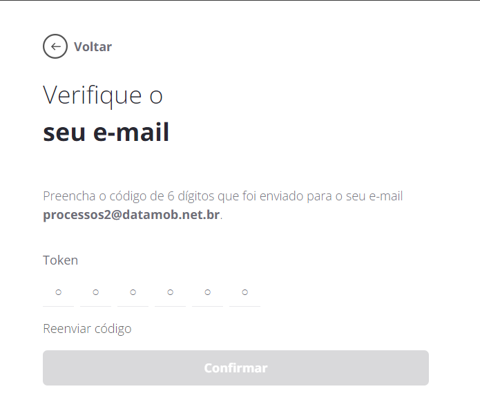

---
layout:
  title:
    visible: true
  description:
    visible: false
  tableOfContents:
    visible: true
  outline:
    visible: true
  pagination:
    visible: true
---

# Acesso ao portal

Quando o **\<NomeProduto>** é ativado para uma empresa, as seguintes tarefas são executadas pelo sistema, para possibilitar o acesso do usuário administrador da empresa ao Portal:

* Criação das credenciais do Portal de Administração;
* Envio de um E-mail de boas-vindas, contendo as credenciais e um link para acessar o Portal de Administração.

Para acessar o Portal de Administração, siga os passos descritos nesta seção:

1. Acesse o endereço <mark style="color:orange;">\<EnderecoProduto></mark> para visualizar a tela de acesso do Portal. De preferência utilize um navegador Google Chrome, com a versão mais atualizada.
2. Preencha os campos de “**E-mail**” e “**Senha**” com as credenciais de acesso, recebidas no E-mail de boas-vindas.
3. Clique em “**Iniciar Seção**” para confirmar as informações e acessar o Portal.

<figure><figcaption></figcaption></figure>

> Em seu primeiro acesso, após clicar em "**Iniciar Sessão**”, o usuário deverá confirmar os dados da empresa. A tela de confirmação dos dados da empresa aparecerá somente no primeiro acesso e é mostrada na figura a seguir.

<figure><figcaption></figcaption></figure>

4. Confirmar o Nome da Empresa e E-mail;
5. Criar uma senha;
6. Repetir a digitação da senha para confirmá-la;
7. Marcar que concorda com a Política de Privacidade e com o Termos de uso;
8. Clicar no botão "Próximo''.

Após o passo 8, uma nova tela de confirmação de E-mail irá aparecer. Uma mensagem com um token de confirmação é enviada para o E-mail da empresa.


**OBSERVAÇÃO**

O E-mail de confirmação é uma mensagem automática e pode ser identificada em seu provedor de E-mail como spam. Por isso, caso não tenha recebido, verifique também na caixa de spam.


9. O token de confirmação deve ser inserido na tela para confirmar o cadastro da empresa. A tela de confirmação é mostrada a seguir:

<mark style="color:red;background-color:orange;">NOVA IMAGEM</mark>

<figure><figcaption></figcaption></figure>

Caso não tenha recebido o token por e-mail, o usuário pode solicitar que seja enviado novamente clicando na opção “**Reenviar código**" que fica disponível logo acima do botão "**Confirmar**".

<figure><figcaption></figcaption></figure>

Após esta confirmação, o sistema abrirá a tela para "Criar conta de administrador".

<mark style="color:red;">Nesta etapa é possível adicionar um e-mail com domínio corporativo, ou seja, será possível realizar a gestão a partir de um domínio corporativo. No domínio corporativo, uma companhia poderá criar várias empresas, a principal diferença é o gerenciamento de contas e autenticação de domínio.</mark>

<figure><figcaption></figcaption></figure>

Caso não possua um e-mail com domínio de trabalho, ao informar outro e-mail e clicar em Próximo, serão exibidas as seguintes opções:

<figure><figcaption></figcaption></figure>

<mark style="color:red;">**Inscreva-se com um e-mail de trabalho**</mark><mark style="color:red;">: o sistema detecta que o endereço de e-mail utilizado é pessoal (ex: @gmail.com) e não é adequado para a inscrição no Android Enterprise. É necessário utilizar um e-mail corporativo (ex: nome@empresa.com). Clique em "Tentar de novo com um e-mail de trabalho para retornar e inserir um endereço de e-mail corporativo válido.</mark>

<mark style="color:red;">**Comprar domínio da empresa**</mark><mark style="color:red;">: caso a sua empresa ainda não possua um domínio próprio (ex: empresa.com) e um e-mail corporativo correspondente, você pode adquirir um novo domínio. Clique em "Comprar um domínio" para ser direcionado a um serviço de registro de domínios, onde você pode comprar um domínio para sua empresa e, em seguida, utilizar um e-mail associado a esse domínio para a inscrição.</mark>

<mark style="color:red;">**Inscreva-se apenas para Android**</mark><mark style="color:red;">: se você está planejando gerenciar apenas dispositivos Android, pode criar um pacote de contas do Google Play gerenciado, mesmo utilizando um e-mail pessoal. Clique em "Inscreva-se" para prosseguir com a inscrição utilizando um e-mail pessoal, limitando a gestão apenas a dispositivos Android.</mark>

#### <mark style="color:red;">Escolhendo a Melhor Opção</mark>

* <mark style="color:red;">**Para Empresas Com Domínio**</mark><mark style="color:red;">: Utilize um e-mail corporativo para um gerenciamento mais completo.</mark>
* <mark style="color:red;">**Para Empresas Sem Domínio**</mark><mark style="color:red;">: Considere comprar um domínio corporativo para uma gestão mais integrada.</mark>
* <mark style="color:red;">**Para Gerenciamento Somente Android**</mark><mark style="color:red;">: Utilize um e-mail pessoal se a gestão se limitar a dispositivos Android, mas esteja ciente das limitações.</mark>

<mark style="color:red;">Para seguir nas telas seguintes, escolha a opção "</mark><mark style="color:red;">**Inscreva-se apenas para Android"**</mark> <mark style="color:red;"></mark><mark style="color:red;">e realize o registro no Android Enterprise.</mark>

Nesta tela será realizada a configuração de uma conta Google Play para a empresa. Esta etapa é importante para que a empresa gerencie os aplicativos que estarão disponíveis em seus dispositivos.&#x20;

Na tela Google Play use o botão “**Fazer Login**" para escolher uma conta ou cadastrar uma nova conta. Importante destacar que o Google não aceita contas GSuite e recomenda-se criar uma conta comum para a empresa (por exemplo, [nomedaempresa@google.com](mailto:nomedaempresa@google.com)).

<figure><figcaption></figcaption></figure>

Durante a criação desta conta Google serão solicitadas mais informações na tela "**Detalhes do Contato**".

Leia as informações de orientação do Google Play Gerenciado e preencha os dados da pessoa da empresa que será o contato oficial de proteção de dados e da pessoa que será o representante da União Europeia. Os dois campos podem ser preenchidos com o mesmo contato da empresa. Estas informações podem ser gerenciadas posteriormente no **\<NomeProduto>** no menu "Empresas", submenu "Informações da Empresa".

A tela de "Detalhes do Contato" é apresentada na sequência.

<figure><figcaption></figcaption></figure>

Após confirmar os dados, será exibida a tela do **\<NomeProduto>** com a mensagem _**"Parabéns! Sua empresa foi registrada no Android Enterprise com sucesso."**_

_<mark style="color:red;background-color:orange;">**NOVA IMAGEM**</mark>_

<figure><figcaption></figcaption></figure>

Clique em "Ok" e poderá iniciar as configurações necessárias para gerenciar os dispositivos da sua empresa.

### **Recuperar Senha**

Caso não lembre a senha de acesso ao portal, realize os seguintes passos para recuperá-la.

1. Clique em “Esqueceu a senha?” logo abaixo do campo Senha. O sistema exibirá a tela de recuperação de senha.

<figure><figcaption></figcaption></figure>

2. Preencha o seu E-mail de usuário e confirme.

<figure><figcaption></figcaption></figure>

Ao clicar em “**Confirmar**” o sistema enviará uma mensagem ao seu endereço de E-mail com instruções para troca de senha.
