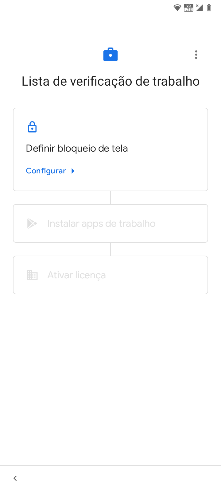
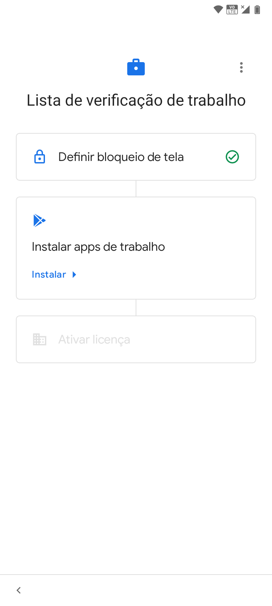

# Configuração

Depois de efetuar o registro através de uma das três opções citadas nas seções anteriores, será exibida a tela "[Lista de Verificação de Trabalho](configuracao.md)", nesta tela deve-se realizar as configurações necessárias para avançar no processo de ativação da <mark style="background-color:orange;">{NOME DO MDM}</mark>.

1. Aceitar e realizar todos os ajustes nas telas do dispositivo até chegar à seguinte tela:

<figure><figcaption></figcaption></figure>

2. Definir um bloqueio de tela para o dispositivo:

<figure><figcaption></figcaption></figure>

3. Na lista de verificação de trabalho, o próximo passo é instalar aplicativos de trabalho. Pressionar "Instalar", na próxima tela serão exibidos os aplicativos de trabalho disponíveis para instalação. Isto depende das configurações de trabalho da empresa.&#x20;
4. Pressionar o botão "Pronto" para continuar.&#x20;

<figure><figcaption></figcaption></figure>

4. Na tela "Lista de Verificação de Trabalho" clicar em  "Ativar licença". Clicar em "Configurar" para iniciar o processo de ativação. Após clicar em "Configurar", a tela aparecerá para iniciar a ativação.

<figure><figcaption></figcaption></figure>
